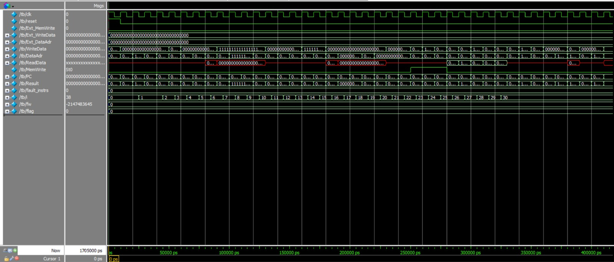
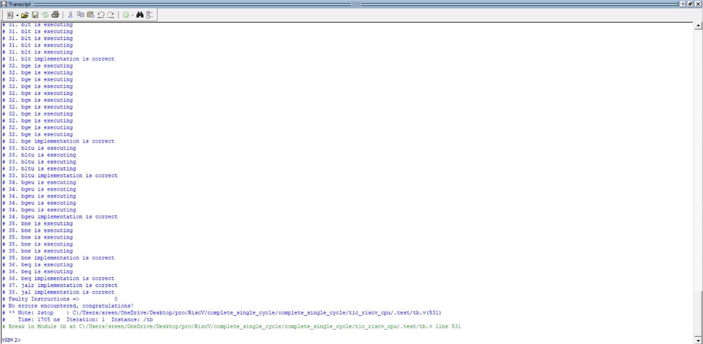
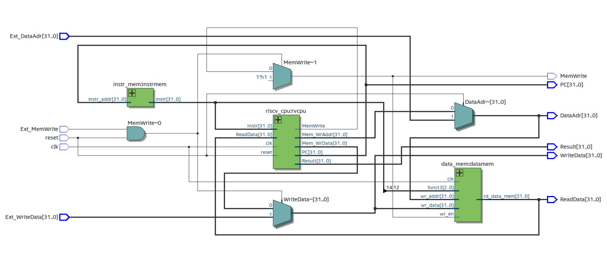
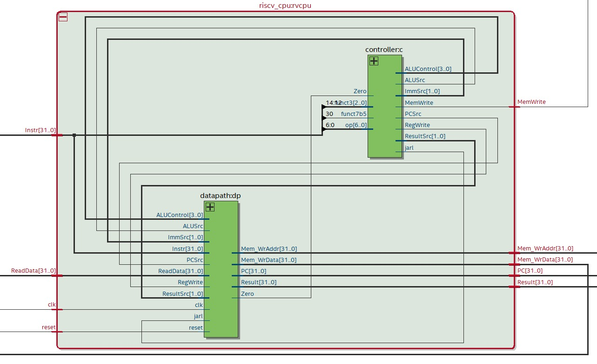
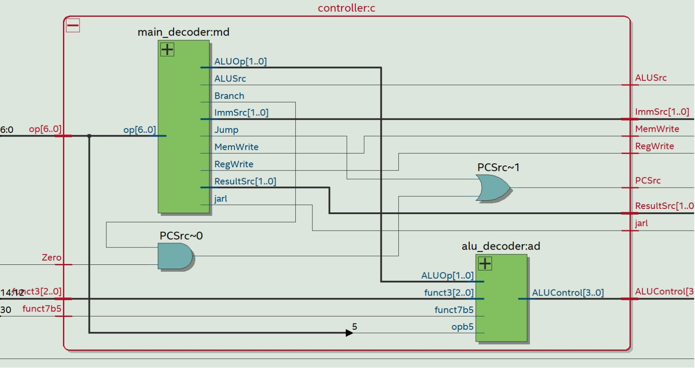
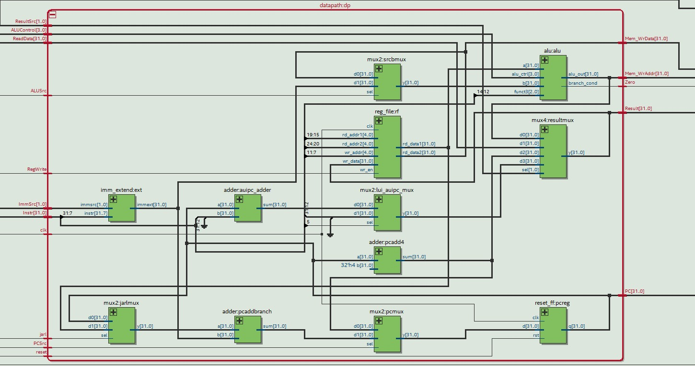
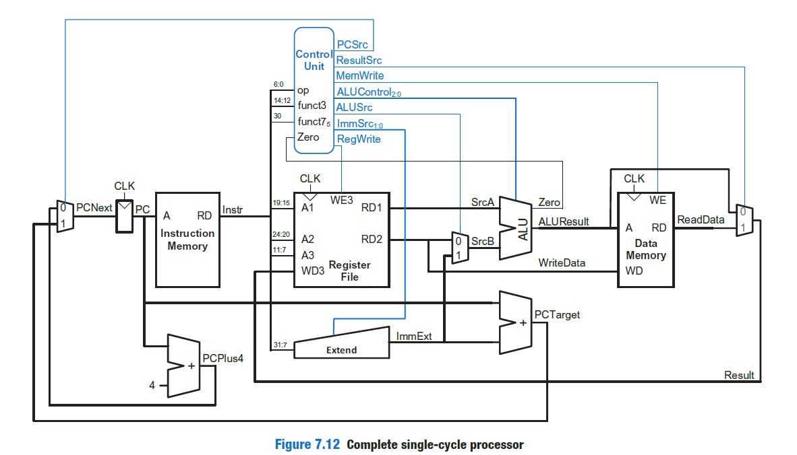

# RISC-V 32-bit Single Cycle Processor

This project presents the design and implementation of a **32-bit single-cycle RISC-V processor** capable of executing all primary instruction formats: **R, I, S, B, U, and J types**. The processor has been rigorously verified using a detailed testbench to ensure correct functionality across all supported instructions.

---

## Key Highlights

### Supported Instruction Categories

The processor supports a wide range of instructions categorized as follows:

| **Format** | **Instructions Included** |
|------------|--------------------------|
| **R-Type** | add, sub, sll, slt, sltu, xor, srl, sra, or, and |
| **I-Type** | addi, slti, sltiu, xori, ori, andi, lb, lh, lw, lbu, lhu |
| **S-Type** | sb, sh, sw |
| **B-Type** | beq, bne, blt, bge, bltu, bgeu |
| **U-Type** | lui, auipc |
| **J-Type** | jal, jalr |

All instructions conform to the **RV32I base integer instruction set**.

---

## Module Interface

The CPU module interacts with external components through the following signals:

| **Signal**        | **Type**  | **Purpose** |
|------------------|----------|------------|
| clk              | Input    | System clock |
| reset            | Input    | Resets the processor |
| Ext_MemWrite     | Input    | External control for memory write |
| Ext_WriteData    | Input    | Data provided externally for memory write |
| Ext_DataAdr      | Input    | External memory address |
| MemWrite         | Output   | Indicates memory write operation |
| WriteData        | Output   | Data sent to memory |
| DataAdr          | Output   | Address used for memory access |
| ReadData         | Output   | Data fetched from memory |
| PC               | Output   | Current program counter value (debug) |
| Result           | Output   | ALU output (debug) |

---

## Design Overview

This processor follows a **single-cycle execution model**, where each instruction completes in one clock cycle. The major building blocks include:

- **Program Counter (PC):** Holds the address of the current instruction  
- **Instruction Memory:** Stores program instructions  
- **Data Memory:** Supports load and store operations  
- **Register File:** 32 general-purpose registers  
- **ALU:** Performs arithmetic and logical operations  
- **Control Unit:** Generates control signals based on instruction decoding  
- **Immediate Generator:** Produces sign-extended immediate values  

## Verification and Results

### Testbench Validation

- **Signal Waveforms:**  
  

- **Simulation Log:**  
  

---

### Netlist Visualization

- **Top-Level CPU View:**  
  

- **Inside CPU:**  
  

- **Inside controller:**

   
- **Inside datapath:**
    

---

## References

- **Reference architecture**
  

- The design approach and concepts are inspired by:

   **Digital Design and Computer Architecture: RISC-V Edition**  
     by Sarah L. Harris and David Harris
